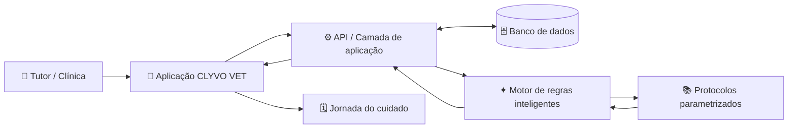

# Arquitetura — CLYVO VET Sprint 3

## Diagrama arquitetural

## Fluxo de dados

1. Tutor ou clínica registra/consulta informações.
2. A aplicação coleta o contexto do pet e o evento de cuidado.
3. A camada de aplicação valida e organiza as entradas.
4. Os dados necessários são consultados no armazenamento.
5. O motor inteligente compara os dados com os protocolos parametrizados.
6. O motor devolve protocolos aplicáveis, prioridade, prazo e justificativa.
7. A aplicação apresenta a recomendação.
8. Ao salvar a análise, uma jornada é criada para acompanhar a execução.

## Componentes

| Componente | Responsabilidade |
|---|---|
| Front-end | Interface, cadastro, filtros, demonstração e jornada |
| API / aplicação | Orquestração do fluxo e regras de negócio |
| Banco | Persistência de perfis, eventos, análises e jornadas |
| Motor inteligente | Avaliação de critérios e recomendação |
| Protocolos | Base de conhecimento parametrizada |
| Jornada | Acompanhamento da obrigação até o cuidado concluído |

## Implementação do protótipo

O protótipo desta entrega roda no navegador com HTML, CSS e JavaScript. O `localStorage` representa a persistência local. A API e o banco aparecem na arquitetura como componentes da solução proposta, mas não são serviços remotos implementados nesta versão.
